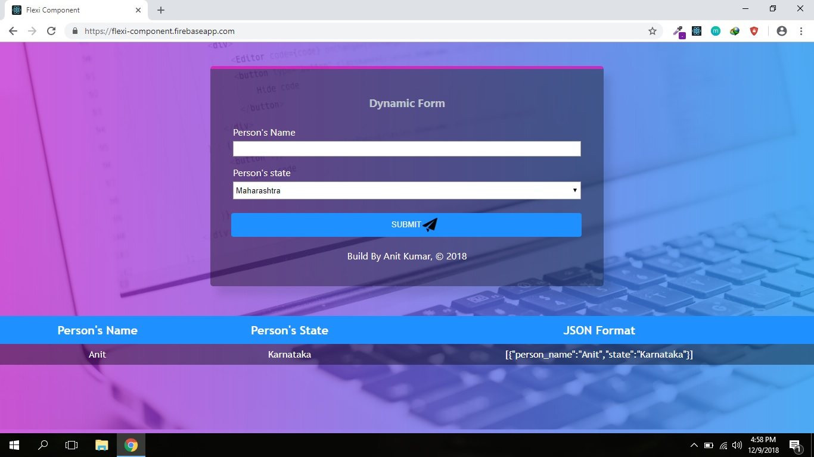

# Flexi Component 

### What is this?
A simple react application which creates HTML elements based on JSON file and also allow user to enter particular details which then converted into JSON. Later it will render what user has entered as a JSON and in table format.

###### Screenshot

#### @ Anit Kumar, 2018  :blush:
